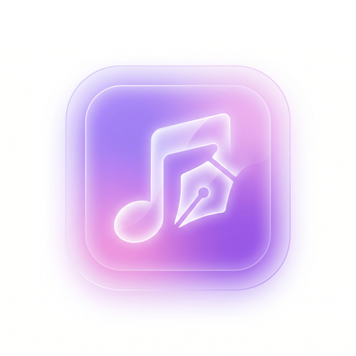

<p align="center">
  
</p>

<h1 align="center">Simple Melody</h1>

<p align="center">
  专为歌词创作设计的 macOS 原生应用 · SwiftUI · Apple Silicon
</p>

<p align="center">
  <a href="https://github.com/VlanTech/Simple-Melody/releases/latest"></a>
  
  
  
</p>

<br>

# 下载最新版 · v1.7.10

<p align="center">
  <a href="https://github.com/VlanTech/Simple-Melody/releases/download/v1.7.10/SimpleMelody-1.7.10.dmg">
    
  </a>
</p>

<p align="center">
  <b>推荐：</b>
  <a href="https://github.com/VlanTech/Simple-Melody/releases/download/v1.7.10/SimpleMelody-1.7.10.dmg"><code>SimpleMelody-1.7.10.dmg</code></a>
  （约 4.8 MB）
  &nbsp;·&nbsp;
  <a href="https://github.com/VlanTech/Simple-Melody/releases/latest">GitHub Releases</a>
  &nbsp;·&nbsp;
  <a href="https://github.com/VlanTech/Simple-Melody/releases/download/v1.7.10/SimpleMelody-1.7.10.zip">备用 ZIP</a>
</p>

仓库根目录也放了同一份安装包，方便直接点开：

- [`SimpleMelody-1.7.10.dmg`](./SimpleMelody-1.7.10.dmg)
- [`SimpleMelody-1.7.10.zip`](./SimpleMelody-1.7.10.zip)

安装：打开 `.dmg`，把 `Simple Melody.app` 拖进「应用程序」。

> 当前安装包**未公证**。若 Gatekeeper 拦截，在 Finder 里对 App **右键 → 打开**，或到「系统设置 → 隐私与安全性」允许这次打开。

**系统要求**：macOS 14 Sonoma 或更高 · Apple Silicon（M1 / M2 / M3 / M4+）

---

## 这是什么

Simple Melody 不是 DAW，也不是富文本编辑器。它是给「一个写词的人」用的：左边收纳曲目，中间是正文 + 段落标记 + 读音注音，右边是灵感 / 设定 / 歌词预览。数据全部存在本机，跟随系统主题。

## 功能

- **曲目库**：搜索、排序、文件夹、拖拽 / 右键上下移、多选删除
- **段落系统**：12 种预设（Intro / Verse / Pre-Chorus / Chorus / …）+ 自定义段落；折叠、笔记、复制
- **读音标注**：手动（假名 / 拼音 / IPA）+ 日语自动注音（内置词组 / 单字字典）；自动与手动用颜色区分
- **灵感与设定**：灵感 / 设定 / 背景 / 备注，独立于歌词正文，导出时不会混进去
- **歌词预览**、**节拍器**、深浅色主题
- **技能炼成**：从 App 内导出「词炼成 / 曲炼成」Skill，交给具备 Agent 能力的 AI 使用
- **四语界面**：简体中文 / 繁體中文 / English / 日本語

## 从源码构建

需要 Xcode 16+。

```bash
git clone https://github.com/VlanTech/Simple-Melody.git
cd Simple-Melody
open SimpleMelody.xcodeproj
```

按 `⌘R` 运行。或命令行：

```bash
xcodebuild -project SimpleMelody.xcodeproj \
           -scheme SimpleMelody \
           -configuration Release \
           -derivedDataPath build \
           build

open build/Build/Products/Release/SimpleMelody.app
```

数据存在：

`~/Library/Containers/com.simplemelody.app/Data/Library/Application Support/default.store`

## 仓库里有什么

```
Simple-Melody/
├── SimpleMelody-1.7.10.dmg      # 最新安装包（显眼放在根目录）
├── SimpleMelody-1.7.10.zip
├── SimpleMelody.xcodeproj/      # Xcode 工程
├── SimpleMelody/                # 应用源码（v1.7.10）
├── skills/                      # 词炼成 / 曲炼成（与 App 内置 Skill 内容一致）
│   ├── smelody-lyric-create/SKILL.md
│   └── smelody-music-create/SKILL.md
├── samples/                     # 示例 .smelody.txt 与曲炼成输出
└── scripts/resize_icons.py
```

### 技能（Skills）

`SimpleMelody/Resources/*.SKILL`（打进 App 的副本）和根目录 `skills/*/SKILL.md` 是同一份内容，没有缺失或分叉：

| Skill | 用途 |
|---|---|
| `smelody-lyric-create` | 让 AI 写出可导入 Simple Melody 的 `.smelody.txt` |
| `smelody-music-create` | 从 `.smelody.txt` 提炼给作曲 AI（SUNO / Udio 等）的提示 |

把 `skills/smelody-lyric-create` 和 `skills/smelody-music-create` 拷到 Agent 的 skills 目录即可。App 设置里的「技能炼成」也会导出同样的文件。

### 示例

| 文件 | 说明 |
|---|---|
| `samples/夏日漫步.smelody.txt` | 完整歌词工程（可导入） |
| `samples/桜の約束.smelody.txt` | 日语示例 |
| `samples/夏日漫步.曲炼成输出.v2.txt` | 曲炼成产物示例 |

## 快捷键

| 快捷键 | 操作 |
|---|---|
| ⌘N | 新建歌曲 |
| ⇧⌘N | 新建段落 |
| ⇧⌘K | 当前段落自动注音 |
| ⌘D | 删除选中曲目 |

## 许可

[MIT](LICENSE) © 2026 VlanTech / Vlan_Channel

开发者：Vlan_Tech · `vlantech@126.com`
